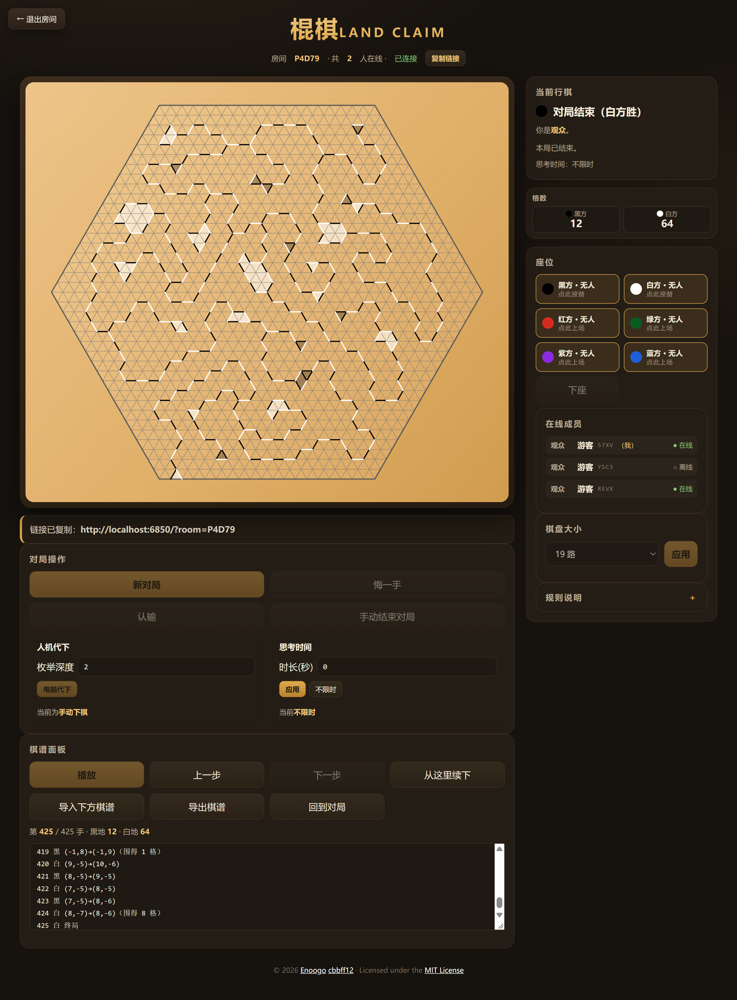
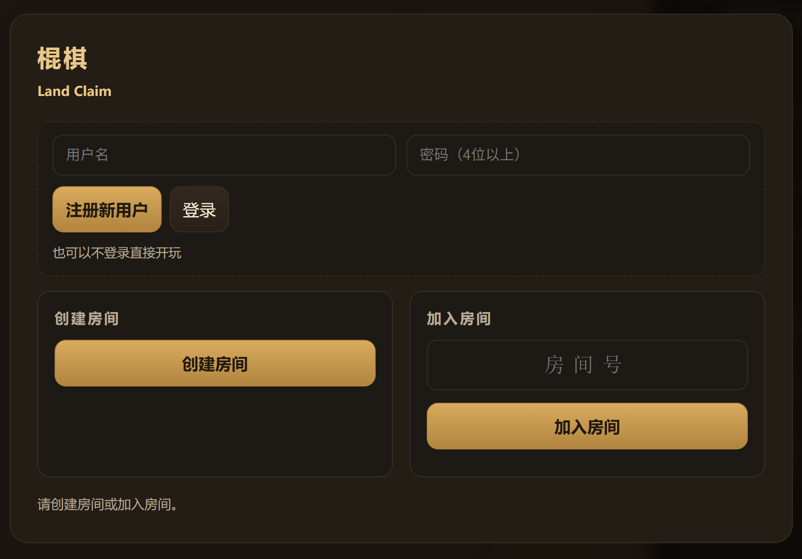

# 棍棋 · LandClaim



一种很新的棋。不是很难算，但是可以有很多演变。
棋盘可以选择9路到31路的奇数。
最少2人对下，最多可以6个人同时下棋。至于观战，软件没有限制人数。
可以导出棋谱，可以复盘，可以分支续下。


---

## 快速开始

本地部署非常的简单。局域网部署就更简单了。

### 1. 主机安装 PHP

| 系统 | 方法 |
| --- | --- |
| Windows | `winget install PHP.PHP.8.4`（装完**重开**命令行窗口） |
| Windows（免安装） | 到 [windows.php.net/download](https://windows.php.net/download/) 下载 **VS16/VS17 x64 ZIP**，解压到如 `C:\php`，把该目录加入系统 `PATH` |
| macOS | `brew install php` |
| Linux | `sudo apt install php-cli` / `sudo dnf install php-cli` |

验证：`php -v` 能打印版本即可。

### 2. 主机启动服务器

双击 **`start-server.bat`**（Windows）或运行 `./start-server.sh`（macOS / Linux），
也可以直接在本目录执行：

```bash
php start.php          # 默认端口 6850
php start.php 7000     # 换端口
```

启动后会显示访问地址，例如：

```
  本机（做主机的这台）：  http://localhost:6850/
  联网（对手用这个）：  http://192.168.1.23:6850/
```


### 3. 开局（不用看，AI乱写的，点进去就会玩了）



1. **主机**：浏览器打开 `http://localhost:6850/` →（先**注册 / 登录**）→ **创建房间** → 记下 5 位**房间号**。
2. **其他人**：浏览器打开主机的**联网地址**（上面第二行）→ 输入房间号 → **加入房间**；
   也可以点「复制邀请链接」发给大家（**电脑端直接复制到剪贴板**，手机端弹窗手动复制），
   打开链接后直接点加入。
3. **进房间后所有人都是观众**：在右侧「座位」里**选一个颜色坐下**就上场
   （黑、白、红、绿、紫、蓝，每人一个颜色）。坐下 **2 人即开打**，按 黑→白→红→绿→紫→蓝 轮流落子。
4. **上场申请**：对局进行中再有**新颜色**坐下 = 发「**上场申请**」，**在场玩家全部点「同意」**才坐得上去
   （于是可以变成 3 人、4 人甚至 5、6 人）；有人拒绝、或 2 分钟没人理会即作废（可撤销重来）。
   空出来的**旧座位可以直接坐上去接替**，不需要申请（见下）。
5. **退出房间**：点**左上角「← 退出房间」**即回大厅（棋手离场等于认输让出座位，别人坐下可以接手这盘棋）。
6. **棋盘大小**：进入房间后右侧「棋盘大小」可改 9 ~ 31 路（默认 19 路），
   改动会**清空棋局重新开始**，房间里所有人同步生效。

**防火墙**：Windows 首次运行会弹窗，请勾选「专用网络」并允许；没弹窗可在
「Windows 防火墙 → 允许应用通过防火墙」里放行 `php.exe`，或手动放行 TCP 6850 端口。

**同一台电脑试玩**：开两个浏览器窗口，一个建房、一个加入即可。

---

## 规则（不用看，AI乱写的）

- **显示**：棋盘线为灰色；棍比的粗细为网格线的2倍，按各自棋子颜色（**黑白红绿紫蓝**）；**刚落下的棍播放落子动画**：该颜色的棍从 **3 倍大、10 倍粗迅速缩回正常大小**，棍的中点始终不动、位置不变，待下的半透明棍为灰色包边。
- **新开一串**：围地之后新的一手，可以贴住**棋盘边框**或**任何一根已下的棍**。
- **禁止一步抢地**：每下一手计数器 +1，**每次围完地之后归 0**。当计数器读数为 **1**（即围完地后的第一手）且这次围地落在**对方已经围的地里**时，**本次围地无效**；计数 ≥2 时围出来的抢地照常允许，在对方地里落子、围空地也照常允许。
- **平分不算**：任何一次把地分成**一样大的两块**（不管分的是空地还是已围住的地），都**不染色、不计数**；这步棋可以下，下一步走「新开一串」。
- **申请**：上场申请、悔一手、新对局、结束对局都会**以弹窗形式发给房间里每个人**。
- **悔一手 / 新对局 / 手动结束对局**：点击后会向所有玩家发起**提议**，**所有在场（坐在座位上）的玩家都点「同意」**才生效；有人拒绝、或 2 分钟没集齐同意即作废（发起人可「撤销提议」）。只剩一位在场玩家时其同意即全票，立即生效。
- **认输**：= **退出比赛**（座位保留）：其余棋手继续下，只剩一人时该人胜、两人对局则对方胜（「悔一手」可回退认输）。
- **下来 / 接替**：坐着的人随时可以点「**下来**」让出座位——**棋局与参赛顺序原样保留、不重置棋盘**；**掉线 30 秒**的棋手也会被自动请下场。空出来的座位**谁都能直接坐上去接替继续下**（不用申请），于是「原来的人掉线了 → 新加入房间的人上场接着下」，棋盘照旧。**轮到空着的颜色会自动跳过**（棋局继续、绝不卡在掉线那家的回合上）；接替者坐回来后照常轮到他，想换别的颜色上场也随时可以。
- **思考时间（可选）**：「对局操作」里可设置思考时间（设置为0秒或者留空就是**不限时**）。轮到的一方超时会被**自动请下场**（棋局保留、别人可接替；**本局不能再上场**），面板上会显示当前行棋方的倒计时。
- **电脑代下**：「对局操作」里点「**电脑代下**」后，轮到你时由电脑**一直自动替你落子**，
  直到再点「**手动接管**」（或你自己在棋盘上落一手）收回人工下。
  旁边的输入框可设定**枚举深度**（枚举到几步之后，1~5 步，默认 2 步）：算法是
  **迭代加深 + minimax + α-β 剪枝**，评估「我的地数 − 最强对手地数」（多人局按对付所有人保守估计），并按「贴线头 / 贴已有结构」裁剪候选着法、带节点 / 时间预算——深度越大越强也越慢，但秒级必出招。
- **断线重连**：刷新页面自动回到自己的座位和棋局；离线会在「在线成员」里显示（超过 30 秒自动下场让位）。
- **座位与上场**：房间人数不限，进房间先当**观众**；在「座位」卡里点空位**坐下**才上场
  （黑、白、红、绿、紫、蓝，每人一个颜色，按这个顺序轮流下）。
  对局进行中**新颜色**坐下要发「**上场申请**」，**所有在场玩家都同意**才能坐上去（可以变成 3~6 人）。
- **注册 / 登录**：大厅里**不再填昵称**，改为**注册用户**（用户名 2-16 位 + 密码至少 4 位）；注册过就填**用户名 + 密码登录**。登录状态存在浏览器里（30 天有效），**同一账号可以在手机 / 电脑上分别登录**：手机退出了，电脑登录同一账号、进同一个房间，就**接管自己原来的座位接着下**（棋局不重置、旧设备的登录自动作废）；掉线 / 下来让出的颜色，账号回来时座位还空着会**自动坐回去接着下**。
  **不注册 / 不登录也能玩**：直接创建 / 加入房间，以「**游客**」临时身份进房下棋。
- **在线成员**：右侧「在线成员」列出所有人，**用户名排在前面**，
  身份 id 用小字淡色备注在旁边，另有角色（黑方/白方/…/观众）与 ●在线 / ○离线，带「（我）」的是你自己。
- **退出房间**：左上角「← 退出房间」随时可以回到大厅（对局没结束时会先确认）。
  棋手退出会让出座位（等于认输），别人加入后可以接手这盘棋；观众退出直接从成员列表移除。
- **棋盘大小**：进房间后右侧「棋盘大小」可选 9 ~ 31 路（默认 19 路），**改动会清空棋局重新开始**。
  棋盘坐标**原点 (0,0) 在棋盘正中心**（a、b 可正可负）；**棋谱与棋盘一一对应**（第一手贴着棋盘边框，
  路数就写在坐标里），所以导入棋谱时会**自动匹配棋盘大小**。
- **终局**：轮到的一方无处可下即结束，三角格多者胜。
- **手动结束对局**：点「手动结束对局」发提议，**所有在场玩家同意**后按当前**地数**（三角格数）结算胜负
  （多者胜、相同为和），随后棋盘以**每秒 10 步**回放整盘动画，并把**纯文本对局记录**写进棋谱框（可复制）。
  **有人不同意**则提议作废、**对局继续，按本该轮到的顺序，转给第一个选了拒绝的人继续下一步**。多人几乎同时拒绝时取轮转顺序上最靠前的那个。
- **实时棋谱**：本局的纯文本对局记录**实时显示在棋盘下方的棋谱框**里，随落子自动更新。每根棍的坐标是**从起端指向终端**。
- **播放 / 暂停**：回放用的是**同一个按钮**——点「播放」开始回放、字样变成「暂停」；
  点「暂停」停下来、字样变回「播放」。播完自动复位成「播放」。
- **对局记录导入**：把棋谱粘贴到棋盘下方的文本框，点「导入下方棋谱」即**自动匹配棋盘大小并开始播放**；也可用「播放 / 暂停」控制自动回放，或「上一步 / 下一步」手动翻看，随时显示**当时的各方地数**。
  **导入自动识别两种格式**：文本里**有「→」就是老棋谱**（按老格式解析），
  **没有「→」就按压缩格式解析**。老棋谱格式：

  ```
  棍棋 · LandClaim 对局记录
  1 黑 (18,1)→(18,0)
  2 白 (18,0)→(19,0)（围得 1 格）
  3 黑 认输
  ```

  （导入兼容 `B/W`、`(a,b)->(c,d)`、`a,b|c,d` 等简写；「认输」「终局」为特殊着法。）

- **导出棋谱 / 压缩棋谱**（0.8.0）：点「**导出棋谱**」后二选一——**复制显示的棋谱**（明文）或
  **复制压缩后的棋谱**。压缩规则：
  1. **每一串棋以第一根棍的坐标开头**：坐标一定在 2 位数以内，去掉括号逗号直接写成 4 位数
     （含正负号，每维 2 位数字），例如 `(-31,6)` 写成 `-3106`；起端坐标 + 终端坐标连写。
  2. 第一根棍定了之后，**后面的棍只可能朝 6 个方向走**（其中一端必须接在线头上），
     六个方向记作 **`a b c d e f`**：
     `a=(+1,0) b=(0,+1) c=(-1,+1) d=(-1,0) e=(0,-1) f=(+1,-1)`。
  3. 每根棍前带 **1 位颜色码**（`1` 黑 `2` 白 `3` 红 `4` 绿 `5` 紫 `6` 蓝），保证导入后各方地盘不串色；
     认输 / 终局 / 加入写作 `R / E / J` + 颜色码。

  例：`1-3106-31072c1a2e…` = 黑棍 (-31,6)→(-31,7)，白棍接它的终端朝 `c` 走，黑棍朝 `a` 走……
  压缩谱里**没有「→」**，粘贴回棋谱框点「导入下方棋谱」即按压缩格式解析回放（与明文互相转换、回环一致）。

- **分支续下**：导入棋谱（或「手动结束对局」的回放）后，用「上一步 / 下一步」**停在想改的那一步**，
  点「**从这里续下**」，整个房间就换成这个局面继续下（对方同步看到）。
  棋谱里的「认输 / 终局」不是棋盘上的着法，分支时自动跳过；棋谱比**房间里的棋盘**大时会提示先切到需要的路数再续下
  （回放用的棋盘已按棋谱自动匹配，续下时以房间棋盘为准）。

---

## 文件结构

| 文件 | 说明 |
| --- | --- |
| `index.html` | 联机客户端（大厅 + 棋盘 + 同步层；注册 / 登录、落子动画、规则层含上述三条规则调整，棋盘边长可变；紫色棋子、申请弹窗、下来/接替、思考时间） |
| `record.js` | 对局记录：手动结束对局回放（每秒 10 步，播放 / 暂停同一按钮）、棋谱导出（明文 / 压缩）与导入（自动识别两种格式）、起端→终端坐标、逐步各方地数 |
| `api.php` | 对局 HTTP API（注册 / 登录 / 令牌校验 · 建房 / 加入·观战 / 坐下·接替 / 下来 / 落子 / 认输 / 手动终局 / 思考时间 / 改棋盘 / 载入棋谱·分支续下 / 提议·回应） |
| `router.php` | PHP 内置服务器路由：静态页 + API，并屏蔽 `data/ src/ tests/` |
| `start.php` | 启动器：打印联网地址并启动 `php -S 0.0.0.0:6850` |
| `start-server.bat` / `start-server.sh` | 一键启动脚本 |
| `src/Logic.php` | 规则与几何（PHP 版，与前端 JS 规则逐条对应；棋盘边长可变，原点在棋盘中心） |
| `src/RoomStore.php` | 房间文件存储（文件锁 + PHP 封印格式） |
| `src/UserStore.php` | 账号存储：注册 / 登录（密码哈希）/ 登录令牌（换设备通用），存 `data/users.php` |
| `src/RoomService.php` | 房间对局领域逻辑（座位·上场申请·下来/接替 / 掉线自动下场 / 思考时间超时踢下场 / 成员标识·账号接管 / 棋盘大小 / 行棋轮次 / 全员同意的提议 / 终局判定） |
| `data/rooms/` | 运行时房间数据（自动生成；7 天无人用自动清理） |
| `data/users.php` | 注册账号与登录会话（自动生成，密码只存哈希） |
| `tests/` | 规则测试 / 房间逻辑测试 / 双引擎交叉验证 / 端到端测试 / 界面静态检查 / 界面运行时冒烟 / 三人对局轮次同步冒烟 |

---

## 工作原理

- **对局事实 = 着法序列**：服务器只存 `[{'p':'B','e':'18,0|18,1'}, ...]`（含认输标记），
  双方浏览器各自用同一套 `Logic` 重放渲染，所以两边棋盘永远一致。
- **服务器权威校验**：`src/Logic.php` 是前端规则的 PHP 移植，落子时在服务端校验
  回合、末端规则 / 新开一串、重合与边框、围地抢地结算、终局判定；越权与非法落子直接拒绝。
- **同步**：客户端每 600ms 轮询 `api.php`（action=state），增量应用新着法；悔棋 / 新局则整体重放。
  **行棋轮次（turn）与参赛顺序（order）以服务器为准**：中途上场 / 让座会改变轮次，
  只靠客户端重放着法推不出来（三人以上对局尤其明显），所以每次同步都用服务器下发的
  `turn / order` 校正本地局面；着法记录里的「加入比赛（j）」标记也照常参与重放。
- **成员与棋盘大小**：房间里记录每个成员的 `token / id / 用户名 / 登录账号 / 角色（黑白红绿紫蓝·观众）/ 最后活跃时间`，
  同步时把 `members`（不含令牌）发给所有人；`room['size']` 是棋盘大小（默认 19 路），
  改大小 = 开一局新棋，两端各自按新边长重建几何（**坐标原点始终在棋盘中心**）。
- **账号**：账号存 `data/users.php`（密码只存 `password_hash` 哈希），
  登录发一个 30 天有效的令牌。带 `user + auth` 进房间时，服务器先找**同账号的旧成员**：
  找到就**接管原身份**（换新令牌、旧设备的令牌作废），坐在座位上就直接回到那个颜色接着下；
  是观众但 `lastColor`（掉线 / 下来让出的颜色）还空着，就自动坐回去接替。没带账号 = 游客（按昵称显示）。
- **下来 / 接替 / 思考时间**：座位只是「谁在下这个颜色」的指针——主动「下来」、掉线 30 秒、思考超时
  都会把人挪回观众（`seats[c] → guests[]`），但**颜色仍留在行棋轮次 `state['order']` 里、棋局不动**，
  新来的人 `sit` 回这个颜色就接着下（不重置棋盘）。**轮次收尾（`normalizeTurn`）会跳过没人坐的颜色**：
  谁掉线 / 下场都不会把棋局卡在他的回合上，其余人照常下，接替者上场后照常轮到他。
  `room['thinkLimit']`（秒，0 = 不限）与 `room['turnStart']` 控制思考倒计时；
  超时被踢下场的人带 `timeoutBan` 标记（本局不能再上场，新的一局解除）。
- **提议全员同意**：`room['proposal'] = {type: undo|new|end, by, votes, at}`，`votes` 记录已同意的颜色；
  集齐**所有在场（坐在座位上）颜色**的同意才执行，有人拒绝或 2 分钟没集齐即作废（提议者调用 = 撤销）。
  **「结束对局」被拒绝**时（0.8.1）对局继续，并把 `state['turn']` 交给**按本该轮到的顺序排在最前的拒绝者**
  （`endReject` 记录提议前该落子的颜色与同一瞬间所有拒绝的人，都按轮转顺序取最靠前的）继续下。
- **新对局清空棋子**（0.8.0）：客户端同步到「棋局被重置」（新对局 / 悔棋 / 载入 / 改棋盘）时，
  如果正在回放（复盘动画没播完）就**先结束回放**，再走「**清空棋子** → 重新重放」两步，
  棋盘上绝不会留下上一局 / 回放遗留的棍。
- **房间数据**：`data/rooms/<房间号>.php`，文件内容是「PHP 封印 + JSON」——
  即使不通过 `router.php` 直接请求该文件，也只会得到空响应，不会泄露棋局与令牌。

---


## FAQ

- **更新代码后，界面行为没变化（还提示旧 bug）**
  浏览器里跑的还是**旧版页面脚本**——脚本在页面加载时就定死了，改文件不会让它变新。
  按 **Ctrl+F5** 强制刷新，或关掉所有旧标签页重新打开。本项目已带三层保险：
  1. `index.html` / `record.js` 都返回 `Cache-Control: no-store`，刷新必定拿到新代码；
  2. **客户端构建号自检**：每个请求都带构建号，与 `api.php` 对不上时服务器直接拒绝，
     页面会提示「还在跑旧版客户端」并**自动刷新**换上新代码（房间身份保存在 sessionStorage，自动回房）；
  3. `tests/ui-check.cjs` 校验 `index.html` 与 `api.php` 的构建号一致，防止改一边漏一边。
- **对手打不开地址**
  1. 两台电脑是否在同一联网（同一 WiFi / 路由器）；
  2. 防火墙是否放行 `php.exe` 或 TCP 6850；
  3. 用 `ipconfig`（Windows）/ `ip addr`（Linux）确认主机地址，别用 `localhost`；
  4. 有些路由器开了「AP 隔离 / 访客网络隔离」，需要在路由器设置里关掉。
- **`start-server.bat` 报错 `'xx' 不是内部或外部命令` / 弹出 NET 帮助**
  这是批处理文件被存成了 UTF-8 中文导致的：cmd.exe 按系统 ANSI 代码页（简体中文是 GBK）解析 `.bat`，
  中文字节会被拆成乱码碎片当命令执行。本目录的 `start-server.bat` 已改成**纯 ASCII**（只有英文提示，
  中文横幅由 `start.php` 输出并自动切换控制台 UTF-8），不会再出这个问题；
  如果你自己改这个文件，**千万不要往里加中文**（包括注释），中文提示写到 `start.php` 里。
- **`php` 不是可识别的命令**：PHP 没有加入 `PATH`，重开终端或把 PHP 目录加入环境变量。
- **启动时报 `Fatal Error Opcode handlers are unusable due to ASLR`**
  这是 **OPcache 与 Windows 强制 ASLR 的已知冲突**（与本项目无关，参见各软件的
  "opcache + ASLR" 规避补丁）。`start.php` 已自带 `-d opcache.enable=0 -d opcache.enable_cli=0` 规避；
  如果你绕过 `start.php` 手动运行 `php -S`，请带上这两个参数。
- **端口 6850 被占用**：`php start.php 7000` 换端口，或关掉占用它的程序。
- **想换执黑白**：退出房间重新建 / 加入即可（也可以选好颜色再创建）。
- **房间数据在哪**：`data/rooms/`，删掉对应文件即清空该房间；整个目录可安全删除。

---

## 测试

```bash
php tests/logic-test.php       # 84 项规则断言（几何 / 末端规则 / 围地 / 抢地 / 平分 / 终局 / 多人轮流）
php tests/service-test.php     # 房间逻辑：下来·接替 / 掉线自动下场 / 全员同意的提议 / 思考时间踢下场 /
                               #   不同意结束对局 → 按轮转顺序转给第一个拒绝的人 / 账号换设备接管原身份
node tests/ui-check.cjs        # 界面静态检查 + 新规则行为 + 棋谱回环（明文 / 压缩）+ 单机版源文件指纹 +
                               #   0.8.1 回归（电脑代下 / 棍加粗·深绿 / 分端复制 / 游客进入 / 报错不带路径）
php tests/cross-check.php      # PHP 规则引擎 ↔ JS 规则引擎交叉验证（需要 node）
node tests/e2e-test.mjs        # 端到端：真实 HTTP 全流程（建房 / 观战 / 落子 / 悔棋 / 结束对局 / 下来·接替 /
                               #   思考时间 / 注册登录 / 纯数字用户名 / 免登录游客进房，需要 php）
node tests/ui-smoke.cjs        # 界面运行时冒烟：DOM 桩跑真实页面脚本（建房 / 成员 / 改棋盘 / 播放暂停 / 退出，需要 php）
node tests/three-player-smoke.cjs  # 三人对局轮次同步：三个「浏览器」跑真实客户端脚本（坐下 / 上场申请 / 轮流落子，需要 php）
```

交叉验证会用 PHP 随机下 8 组完整对局，再用前端的 JS 规则引擎逐步重放，
比对每一步的围地数、地盘归属、合法落点集合等 900+ 个局面快照；
端到端测试会真正起一个服务器，模拟两名玩家走完建房 → 落子 → 悔棋 → 认输 → 新局的全过程。
